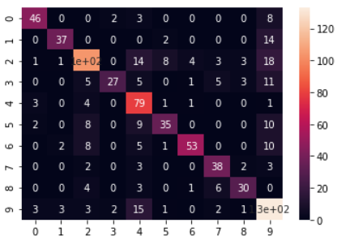

# CS 254 Final Project

**Project Goal**: Create a classifier that can classify paintings by their
respective artist

## Developers:

- Clay Kaufmann
- John Richardson
- Colin Giles

## Dataset

The dataset is titled "Best Artworks of All Time", and is available on
Kaggle [here](https://www.kaggle.com/ikarus777/best-artworks-of-all-time).
The license for the dataset is available
[here](https://creativecommons.org/licenses/by-nc-sa/4.0/).

The dataset includes over 16,000 paintings by 50 different artists. We decided
to cut down the number of artists to just 10, in order to simplify
classification. We took the top 10 artists by their number of paintings in the
dataset.

The artists:

- Vincent Van Goph
- Edgar Degas
- Pablo Picasso
- Pierre Auguste Renoir
- Albrecht Dürer
- Paul Gauguin
- Francisco Goya
- Rembrandt
- Alfred Sisley
- Titian
- Marc Chagall

## Main File

The file `main.ipynb` illustrates our data processing approach, as well as a
very simple (and bad) CNN. A classification report and confusion matrix for the
model are also included.

### Image Generators

Keras image generators are used here to augment the small dataset

## Clay's Model

### Code Description

To see Clay's model, go to the file `clay_model.ipynb`. This file contains the
same data loading procedures as the main file, but with his model. The file
`clay_model.py` is a normal python version of the model, that does not include
the classification report and confusion matrix. This version was used in the
[Vermont Advanced Computing Core](https://www.uvm.edu/vacc) to train the model.
Finally, the file `clay_trained_model.hdf5` contains the actual trained model,
used in the jupyter file to run a classification report and create a confusion
matrix.

### Model Description

This model takes advantage of InceptionV3 using transfer learning with Keras.
After InceptionV3, a flattening layer is added, followed by a BatchNormalization
layer, a fully connected layer wth 256 neurons, a dropout layer, and finally an
output layer of 10 neurons with a softmax activation function.

### Results

Overall, the model finished with an f1-score of 0.77, making it fairly
accurate, especially considering there were 10 classes. That being said, it is
not quite where I would want it to be. If more time were allotted, I would focus
on adding a few more layers to the model after the Inception network to try and
add more capacity for learning.

First up is the classification report, using sklearn metrics:

Here is the confusion matrix for the model.

Finally we have two plots, accuracy and loss over epochs.

## Colin's Model

## John's Model
